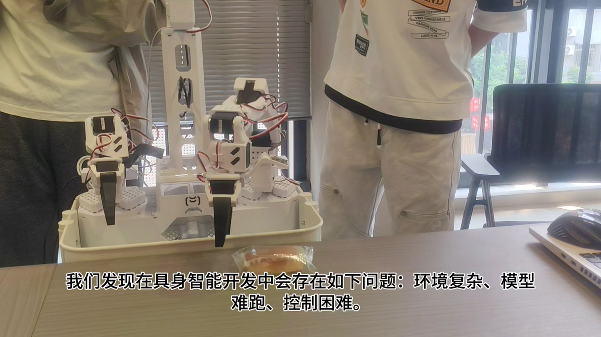
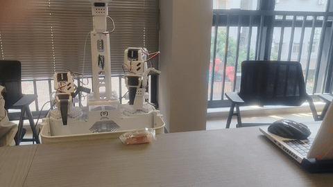
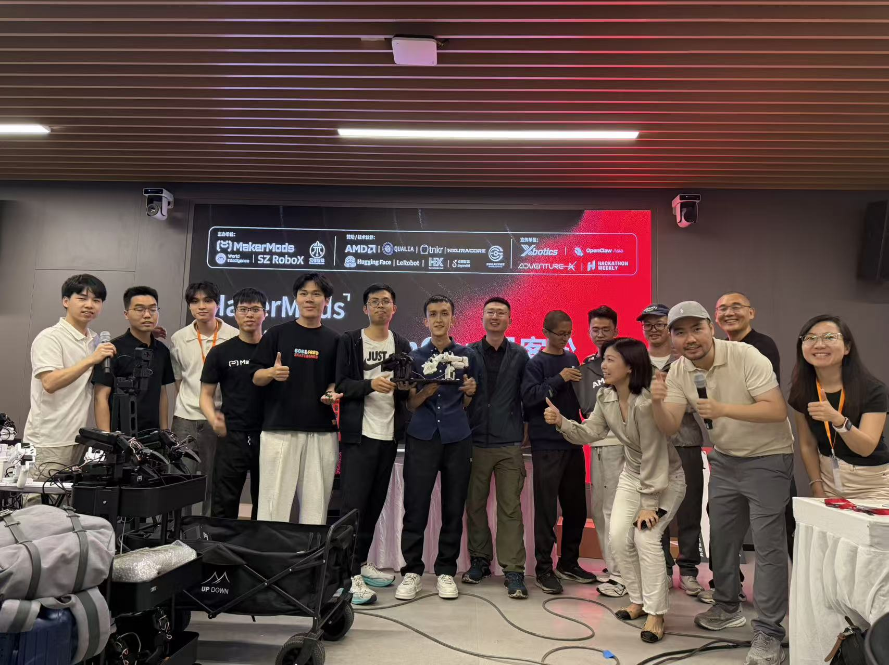
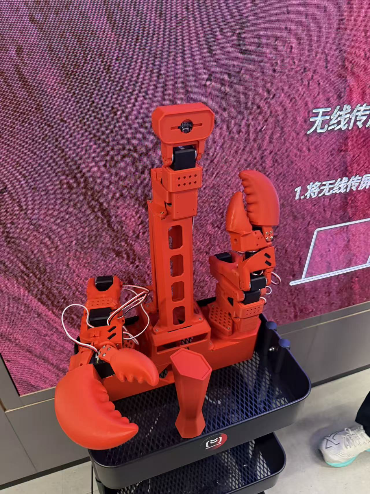
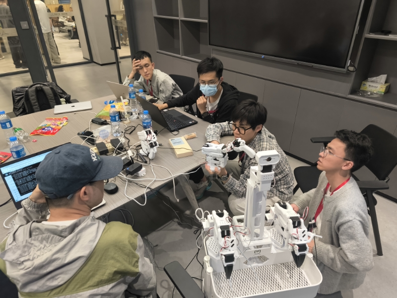
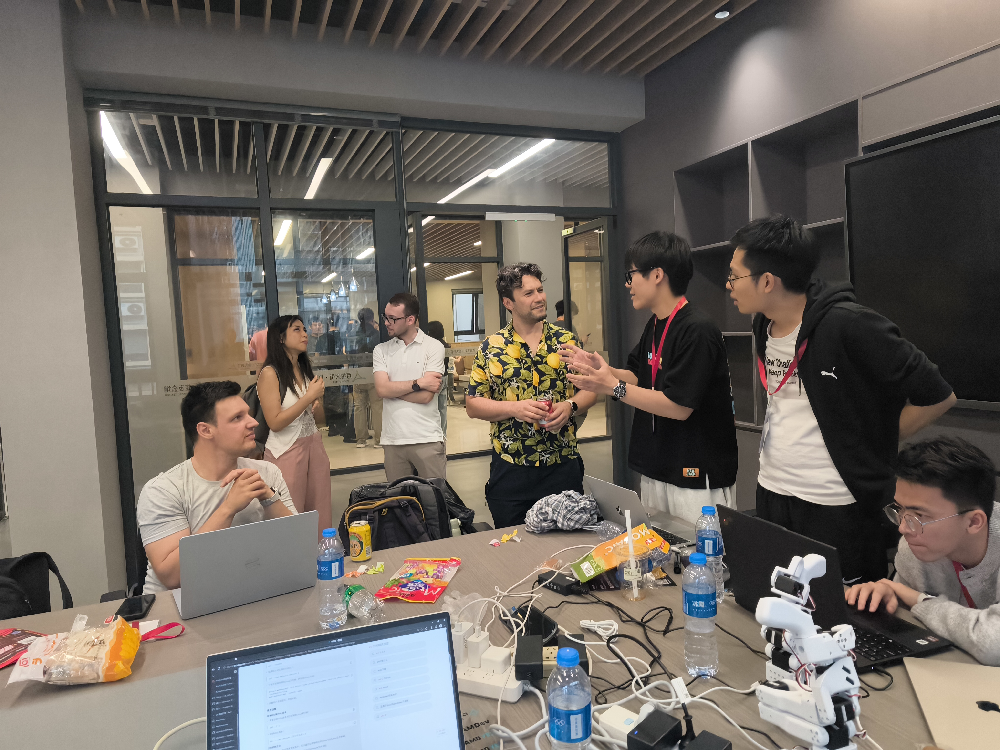

# MakerMods Hackathon 软件交付仓库

[English](README.md) | [简体中文](README.zh-CN.md)

这是我们 MakerMods + LeRobot 项目的黑客松交付仓库。仓库中包含前端、后端、硬件辅助脚本、公开的 Hugging Face 数据与模型链接、交付视频，以及后续开发者最需要先看到的工程说明。

## 交付内容

- **软件源码**：本仓库
- **项目使用的 LeRobot fork**：[Maker-Mods/lerobot-MakerMods](https://github.com/Maker-Mods/lerobot-MakerMods)
- **Hugging Face 数据集**：[Adkid/pickupbreadCombine12](https://huggingface.co/datasets/Adkid/pickupbreadCombine12)
- **Qualia 训练出的模型**：[qualia-robotics/act-pickupbreadcombine12-e0ad61c9](https://huggingface.co/qualia-robotics/act-pickupbreadcombine12-e0ad61c9)
- **交付视频**：[docs/assets/videos/makermods-delivery-video.mp4](docs/assets/videos/makermods-delivery-video.mp4)
- **ACT 夹面包演示视频**：[docs/assets/videos/act-bread-grasp-demo.mp4](docs/assets/videos/act-bread-grasp-demo.mp4)
- **Bug 日志**：[docs/BUG_LOG.md](docs/BUG_LOG.md)
- **开发者警告**：[docs/DEVELOPER_WARNINGS.md](docs/DEVELOPER_WARNINGS.md)

## 演示视频

[](docs/assets/videos/makermods-delivery-video.mp4)

这是最终交付视频，点击预览图即可打开完整 MP4。

[](docs/assets/videos/act-bread-grasp-demo.mp4)

这里直接展示的是会动的 GIF 预览，对应的是我们基于录制数据与 Qualia 训练流程得到的 ACT 模型效果。点击它可以打开完整 MP4。

GitHub 在 `README.md` 中通常不会稳定内嵌播放仓库里的 MP4，所以这里使用可点击的预览图，点击后即可打开完整视频。

## 项目现场图集

获奖与最终交付现场：



机器人近景：



黑客松工作过程：



现场讨论与评审交流：



## 项目概述

本项目把 LeRobot CLI 封装成了一个浏览器工作流，覆盖了这些核心环节：

- 机器人配置
- 串口分配
- 相机检测与预览
- 校准
- 遥操作
- 数据集录制
- Qualia 训练任务提交
- 策略推理

后端基于 FastAPI，通过子进程调用 LeRobot；前端是 Next.js 的向导式界面，目标是降低演示和采集流程中的人工失误。

## 当前真实状态

这个仓库记录的是项目在黑客松交付阶段的真实工程状态，不是一个已经完全产品化的版本。

- 前端、后端和硬件工作流已经联通并实际使用过。
- 自动校准已经可以通过 UI 正常运行。
- 遥操作相关问题已经在当前代码中完成排查与修复。
- 数据集和 Qualia 训练模型已经成功产出并发布到 Hugging Face。
- 最终交付视频已经作为可复现实验产物放入仓库。
- 系统目前仍然受运行环境影响较大，尤其是 macOS 相机权限、本地 Python 路径、串口稳定性这几类问题。

换句话说，这是一套“已经能交付、能演示、能复现关键结果”的黑客松软件成果，但在稳定性、部署标准化和可维护性方面还有进一步打磨空间。

## 产物链接

| 产物 | 链接 | 说明 |
| --- | --- | --- |
| 数据集 | [Adkid/pickupbreadCombine12](https://huggingface.co/datasets/Adkid/pickupbreadCombine12) | 本次训练使用的主数据集 |
| 模型 | [qualia-robotics/act-pickupbreadcombine12-e0ad61c9](https://huggingface.co/qualia-robotics/act-pickupbreadcombine12-e0ad61c9) | 通过 Qualia 训练得到的 ACT 模型 |
| LeRobot fork | [Maker-Mods/lerobot-MakerMods](https://github.com/Maker-Mods/lerobot-MakerMods) | 机器人侧与 LeRobot 侧改动 |
| 交付视频 | [docs/assets/videos/makermods-delivery-video.mp4](docs/assets/videos/makermods-delivery-video.mp4) | 最终项目演示视频 |
| ACT 演示视频 | [docs/assets/videos/act-bread-grasp-demo.mp4](docs/assets/videos/act-bread-grasp-demo.mp4) | 训练后 ACT 模型执行夹面包任务 |
| ACT 动态预览 GIF | [docs/assets/videos/act-bread-grasp-demo.gif](docs/assets/videos/act-bread-grasp-demo.gif) | README 中直接可见的动态图预览 |

## 快速启动

### 前置条件

- Python 3.10+
- Node.js 18+
- 可正常运行的 LeRobot 环境
- 可访问配套 fork：[Maker-Mods/lerobot-MakerMods](https://github.com/Maker-Mods/lerobot-MakerMods)

### 后端

请使用已经安装好 `lerobot` 的 Python 环境启动。

```bash
cd /path/to/MakerMods-LeRobot-UI
PYTHONPATH=/path/to/lerobot-MakerMods/src python -m backend.main
```

### 前端

```bash
cd /path/to/MakerMods-LeRobot-UI/frontend
npm install
npm run dev
```

然后打开 `http://localhost:3000`。

## 部署建议

后续演示或团队交接时，建议把源码、运行环境、模型数据三类内容明确隔离。

### 推荐部署结构

1. 把本仓库作为应用层：
   - frontend
   - backend
   - scripts
   - docs
2. 把 LeRobot fork 作为独立仓库单独检出。
3. 尽量把 Python 环境放在 Git 工作树之外。
4. 数据集和训练模型继续存放在 Hugging Face，而不是放进 Git 历史。

### 推荐运行环境

- 若追求稳定演示，优先使用独立 Linux 或 Jetson 环境。
- 如果必须用 macOS，务必在演示前验证相机权限和串口权限。
- 启动后端时始终显式传入指向 LeRobot 源码的 `PYTHONPATH`。
- 前后端分开启动，便于日志定位与故障隔离。
- 演示前预先缓存一份已验证可用的模型，避免现场依赖下载。

### 实操建议

- 在修改硬件、依赖或校准逻辑前，先打 tag 或保存一个已知可用的提交。
- 保留一个稳定环境专门用于演示，再保留一个独立环境用于实验。
- 重新校准前备份 calibration 文件和当前配置。
- 把本地 cache 当作可丢弃对象，把 Hugging Face 上的数据和模型当作事实来源。

## 环境事故与隔离说明

我们第一次本地环境搭建并没有稳定成功。失败状态被保留在本地 LeRobot 工作区中，作为排查记录：

- `.conda-env-broken-20260329-142732`
- `.sparse-backup-20260329`

正因为经历过这次环境崩溃，项目现在才明确要求把环境状态、源码、缓存和公开交付物分开管理。实践规则很简单：

1. 在做大规模依赖或硬件改动前先提交或打 tag
2. 高风险实验使用独立环境
3. 本地缓存和生成产物不要进 Git
4. 大文件数据和模型放到 Hugging Face，不放 GitHub

更多说明见 [docs/DEVELOPER_WARNINGS.md](docs/DEVELOPER_WARNINGS.md)。

## 已知问题与开发者说明

- Bug 追踪与复现记录：[docs/BUG_LOG.md](docs/BUG_LOG.md)
- 开发者警告与配置注意事项：[docs/DEVELOPER_WARNINGS.md](docs/DEVELOPER_WARNINGS.md)

最重要的几个坑如下：

- 在 macOS 上，相机权限是授予宿主应用进程链，而不是只授予 Python
- 推理启动时必须使用包含 LeRobot 源码路径的 `PYTHONPATH`
- 评测数据集命名应唯一，且建议以 `eval_` 开头
- 双臂模式下，串口与校准 ID 的左右对应关系必须严格一致

## 后续改进方向

下一步更应该优先提升稳定性和可维护性，而不是继续无节制加功能。

- 把后端启动收敛成一个可重复、带环境检查的统一入口
- 把脚本里的机器本地路径改成配置项或环境变量
- 分别补齐 Linux、macOS、Jetson 的部署文档
- 在真正开始运行前增加健康检查：相机授权、Hugging Face 登录、模型路径合法性、串口锁状态
- 给前后端补 CI，避免回归问题在演示现场才暴露
- 发布版本化 release note 和稳定演示配置
- 把最终视频同时作为 GitHub Release 资产发布，而不仅仅放在仓库目录里
- 继续削减遥操作与推理路径上的依赖重量，缩短启动时间并降低调试难度

## 仓库结构

| 路径 | 说明 |
| --- | --- |
| `backend/` | FastAPI 路由与服务层 |
| `frontend/` | Next.js 向导式 UI |
| `docs/BUG_LOG.md` | bug 日志与修复/缓解记录 |
| `docs/DEVELOPER_WARNINGS.md` | 环境与开发警告 |
| `docs/assets/` | 交付媒体资源 |
| `PROGRESS.md` | 实现与变更日志 |

## License

本交付仓库采用 [MIT License](LICENSE)。

相关外部产物仍然遵循各自原有许可证：

- 关联的 LeRobot fork 继续遵循其原始 Apache-2.0 许可
- Hugging Face 数据集和模型以各自页面声明的许可证为准
